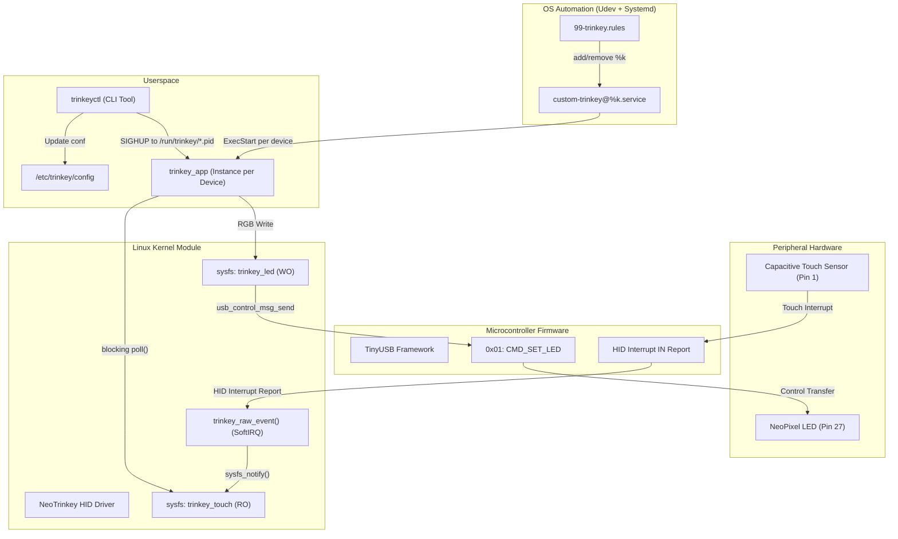

# NeoTrinkey Custom Driver & Multi-Device Suite 🚀

[](https://kernel.org)
[](https://en.wikipedia.org/wiki/C11_(C_standard_revision))
[](LICENSE)

Project for the **Advanced Operating Systems** course (Politecnico di Milano).  
Implements a complete software stack (*full-stack embedded & system programming*) for advanced, reactive, and multi-device management of the **Adafruit NeoKey Trinkey** board (USB Vendor ID `0x239a`, Product ID `0x80ff`).

---

## 🌟 Main Features

- **Reactive HID Kernel Driver (`NeoTrinkey_custom_driver.c`)**: Module driver for the Linux kernel based on `hid_driver`. Instead of periodic polling, it handles events in an interrupt context (`raw_event`) instantly notifying userspace via `sysfs_notify()`.
- **Isolated Multi-Device Support via Systemd**: Native integration using **Systemd Template Unit** (`custom-trinkey@.service`) and **Udev** rules (`99-trinkey.rules`). Every inserted USB key automatically starts an isolated instance of `trinkey_app`.
- **Event-Driven Userspace Daemon (`trinkey_app.c`)**: Daemon listening via `poll()` on sysfs attributes. Supports LED animations (`static`, `blink`, `breath`) and immediate response to capacitive touch.
- **CLI Control Utility (`trinkeyctl.c`)**: Command-line tool to update the configuration in `/etc/trinkey/config` and send `SIGHUP` notifications to all active daemon instances.

---

## 🏗️ System Architecture



---

## 📁 Project Structure

```
.
├── NeoTrinkey_custom_driver.c   # Linux Kernel Module (HID Driver)
├── trinkey_app.c                # Userspace Daemon (Event-driven poll)
├── trinkeyctl.c                 # Configuration CLI Utility
├── 99-trinkey.rules             # Udev rules to bind and start systemd instances
├── custom-trinkey@.service      # Systemd template unit for dynamic instances
├── firmware.cpp                 # Microcontroller firmware code (Arduino/TinyUSB)
├── Makefile                     # Buildscript for kernel module and userspace apps
├── README.md                    # Project documentation
└── report_neotrinkey_custom_driver.md # Technical project report
```

---

## 🛠️ Compilation and Installation

### 1. System Requirements
Ensure you have the development packages for the running kernel and the GCC compiler installed:

```bash
sudo apt update
sudo apt install build-essential linux-headers-$(uname -r)
```

### 2. Compilation
To compile both the kernel module (`NeoTrinkey_custom_driver.ko`) and the userspace programs (`trinkey_app`, `trinkeyctl`):

```bash
make all
```

---

## ⚙️ System Deployment and Configuration

### 1. Installation of Binaries and Systemd Units

Copy the compiled binaries and configuration files to the system directories:

```bash
# Copy user applications
sudo cp trinkey_app /usr/local/bin/
sudo cp trinkeyctl /usr/local/bin/
sudo chmod +x /usr/local/bin/trinkey_app /usr/local/bin/trinkeyctl

# Install Systemd Template Service
sudo cp custom-trinkey@.service /etc/systemd/system/
sudo systemctl daemon-reload

# Install Udev Rules
sudo cp 99-trinkey.rules /etc/udev/rules.d/
sudo udevadm control --reload-rules
sudo udevadm trigger
```

### 2. Configuration Directory Creation and User Permissions

Create the global configuration file and assign the necessary permissions:

```bash
# Create configuration folder and file
sudo mkdir -p /etc/trinkey
sudo touch /etc/trinkey/config

# Create 'trinkey' user group and assign permissions
sudo groupadd -f trinkey
sudo usermod -aG trinkey $USER
sudo chown -R root:trinkey /etc/trinkey
sudo chmod 775 /etc/trinkey
sudo chmod 664 /etc/trinkey/config

# Configure SUID bit for trinkeyctl (optional to allow execution without sudo)
sudo chown root:trinkey /usr/local/bin/trinkeyctl
sudo chmod 4755 /usr/local/bin/trinkeyctl
```

### 3. Loading the Kernel Module

To load the kernel module and enable it at boot:

```bash
# Manual load
sudo insmod NeoTrinkey_custom_driver.ko

# (Optional) Permanent module installation
sudo cp NeoTrinkey_custom_driver.ko /lib/modules/$(uname -r)/kernel/drivers/hid/
sudo depmod -a
echo "NeoTrinkey_custom_driver" | sudo tee /etc/modules-load.d/trinkey.conf
```

---

## 🕹️ Using `trinkeyctl`

The `trinkeyctl` utility allows you to modify the LED behavior and touch responses without interrupting the running services.

### Available options:
- `-m <mode>` : Idle LED mode (`static`, `blink`, `breath`)
- `-i "R G B"` : Idle color (RGB values `0..255`)
- `-t "R G B"` : Touch color (RGB values `0..255`)

### Usage examples:

```bash
# Set idle color to Blue and touch color to Green in static mode
trinkeyctl -m static -i "0 0 255" -t "0 255 0"

# Set Red "breath" fade effect with White touch
trinkeyctl -m breath -i "255 0 0" -t "255 255 255"

# Set Yellow "blink" flashing
trinkeyctl -m blink -i "255 255 0" -t "0 255 0"
```

When you execute `trinkeyctl`, the `/etc/trinkey/config` file is updated, and a `SIGHUP` signal is sent to all active instances of `trinkey_app`, applying the change instantly to all connected NeoTrinkey keys.

---

## 🔍 Verifying Multi-Device Operation

To check the status of the services managed by Systemd for each connected NeoTrinkey:

```bash
# List all active Trinkey services
systemctl list-units "custom-trinkey@*"

# View logs for a specific instance
journalctl -u custom-trinkey@0003:239A:80FF.0001.service -f
```

---

## 👥 Authors

- **Federico Paludetti** (`P4LW`)
- **Riccardo Passolunghi** (`passo`)

*Project developed for the Advanced Operating Systems course.*
