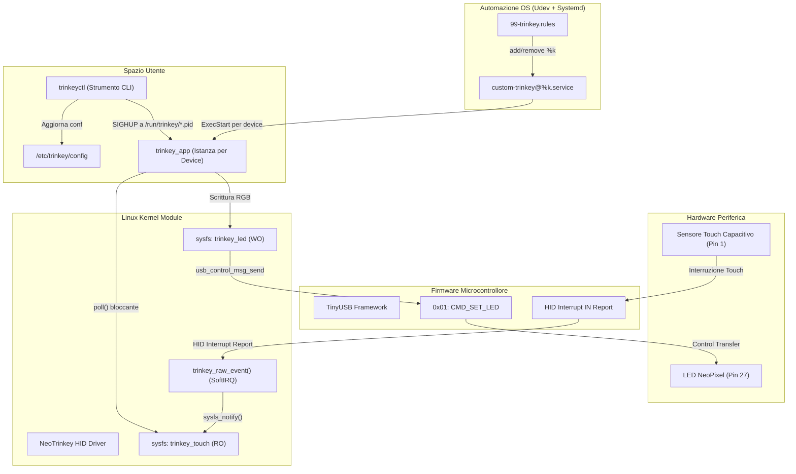

# NeoTrinkey Custom Driver & Multi-Device Suite 🚀

[](https://kernel.org)
[](https://en.wikipedia.org/wiki/C11_(C_standard_revision))
[](LICENSE)

Progetto per il corso di **Sistemi Operativi Avanzati** (Politecnico di Milano).  
Implementa una pila software completa (*full-stack embedded & system programming*) per la gestione avanzata, reattiva e multi-dispositivo della scheda **Adafruit NeoKey Trinkey** (USB Vendor ID `0x239a`, Product ID `0x80ff`).

---

## 🌟 Caratteristiche Principali

- **Driver Kernel HID Reattivo (`NeoTrinkey_custom_driver.c`)**: Driver di modulo per il kernel Linux basato su `hid_driver`. Invece del polling periodico, gestisce gli eventi in contesto di interrupt (`raw_event`) notificando istantaneamente lo spazio utente tramite `sysfs_notify()`.
- **Supporto Multi-Dispositivo Isolato via Systemd**: Integrazione nativa tramite **Systemd Template Unit** (`custom-trinkey@.service`) e regole **Udev** (`99-trinkey.rules`). Ogni chiavetta USB inserita avvia automaticamente un'istanza isolata di `trinkey_app`.
- **Daemon Spazio Utente Event-Driven (`trinkey_app.c`)**: Daemon in ascolto mediante `poll()` sugli attributi sysfs. Supporta animazioni LED (`static`, `blink`, `breath`) e risposta immediata al tocco capacitivo.
- **Utility di Controllo CLI (`trinkeyctl.c`)**: Tool a riga di comando per aggiornare la configurazione in `/etc/trinkey/config` ed inviare notifiche `SIGHUP` a tutte le istanze del daemon attive.

---

## 🏗️ Architettura del Sistema



---

## 📁 Struttura del Progetto

```
.
├── NeoTrinkey_custom_driver.c   # Modulo Kernel Linux (HID Driver)
├── trinkey_app.c                # Daemon spazio utente (Event-driven poll)
├── trinkeyctl.c                 # Utility CLI di configurazione
├── 99-trinkey.rules             # Regole Udev per bind e avvio istanze systemd
├── custom-trinkey@.service      # Unità template Systemd per istanze dinamiche
├── firmware.cpp                 # Codice firmware microcontrollore (Arduino/TinyUSB)
├── Makefile                     # Buildscript per modulo kernel e app spazio utente
├── README.md                    # Documentazione del progetto
└── report_neotrinkey_custom_driver.md # Relazione tecnica di progetto
```

---

## 🛠️ Compilazione ed Installazione

### 1. Requisiti di Sistema
Assicurarsi di avere installato i pacchetti di sviluppo per il kernel in uso e il compilatore GCC:

```bash
sudo apt update
sudo apt install build-essential linux-headers-$(uname -r)
```

### 2. Compilazione
Per compilare sia il modulo del kernel (`NeoTrinkey_custom_driver.ko`) sia i programmi nello spazio utente (`trinkey_app`, `trinkeyctl`):

```bash
make all
```

---

## ⚙️ Deploy e Configurazione di Sistema

### 1. Installazione dei Binari e delle Unità Systemd

Copia i binari compilati e i file di configurazione nelle directory di sistema:

```bash
# Copia delle applicazioni utente
sudo cp trinkey_app /usr/local/bin/
sudo cp trinkeyctl /usr/local/bin/
sudo chmod +x /usr/local/bin/trinkey_app /usr/local/bin/trinkeyctl

# Installazione del Servizio Systemd Template
sudo cp custom-trinkey@.service /etc/systemd/system/
sudo systemctl daemon-reload

# Installazione delle Regole Udev
sudo cp 99-trinkey.rules /etc/udev/rules.d/
sudo udevadm control --reload-rules
sudo udevadm trigger
```

### 2. Creazione della Directory di Configurazione e Permessi Utente

Crea il file di configurazione globale ed assegna i permessi necessari:

```bash
# Creazione cartella e file di configurazione
sudo mkdir -p /etc/trinkey
sudo touch /etc/trinkey/config

# Creazione gruppo utenti 'trinkey' e assegnazione permessi
sudo groupadd -f trinkey
sudo usermod -aG trinkey $USER
sudo chown -R root:trinkey /etc/trinkey
sudo chmod 775 /etc/trinkey
sudo chmod 664 /etc/trinkey/config

# Configurazione del bit SUID per trinkeyctl (opzionale per permettere esecuzione senza sudo)
sudo chown root:trinkey /usr/local/bin/trinkeyctl
sudo chmod 4755 /usr/local/bin/trinkeyctl
```

### 3. Caricamento del Modulo Kernel

Per caricare il modulo del kernel ed abilitarlo all'avvio:

```bash
# Caricamento manuale
sudo insmod NeoTrinkey_custom_driver.ko

# (Opzionale) Installazione permanente del modulo
sudo cp NeoTrinkey_custom_driver.ko /lib/modules/$(uname -r)/kernel/drivers/hid/
sudo depmod -a
echo "NeoTrinkey_custom_driver" | sudo tee /etc/modules-load.d/trinkey.conf
```

---

## 🕹️ Utilizzo di `trinkeyctl`

L'utility `trinkeyctl` permette di modificare il comportamento dei LED e le risposte al tocco senza interrompere i servizi in esecuzione.

### Opzioni disponibili:
- `-m <mode>` : Modalità LED a riposo (`static`, `blink`, `breath`)
- `-i "R G B"` : Colore a riposo (valori RGB `0..255`)
- `-t "R G B"` : Colore al tocco (valori RGB `0..255`)

### Esempi di utilizzo:

```bash
# Imposta colore di riposo Blu e colore di tocco Verde in modalità statica
trinkeyctl -m static -i "0 0 255" -t "0 255 0"

# Imposta effetto effetto dissolvenza "breath" Rosso con tocco Bianco
trinkeyctl -m breath -i "255 0 0" -t "255 255 255"

# Imposta lampeggio "blink" Giallo
trinkeyctl -m blink -i "255 255 0" -t "0 255 0"
```

Quando si esegue `trinkeyctl`, il file `/etc/trinkey/config` viene aggiornato e viene inviato un segnale `SIGHUP` a tutte le istanze attive di `trinkey_app`, applicando la modifica istantaneamente su tutte le chiavette NeoTrinkey collegate.

---

## 🔍 Verifica del Funzionamento Multi-Dispositivo

Per verificare lo stato dei servizi gestiti da Systemd per ciascuna NeoTrinkey collegata:

```bash
# Elenco di tutti i servizi Trinkey attivi
systemctl list-units "custom-trinkey@*"

# Visualizza i log di un'istanza specifica
journalctl -u custom-trinkey@0003:239A:80FF.0001.service -f
```

---

## 👥 Autori

- **Federico Paludetti** (`P4LW`)
- **Riccardo Passolunghi** (`passo`)

*Progetto sviluppato per il corso di Sistemi Operativi Avanzati.*
