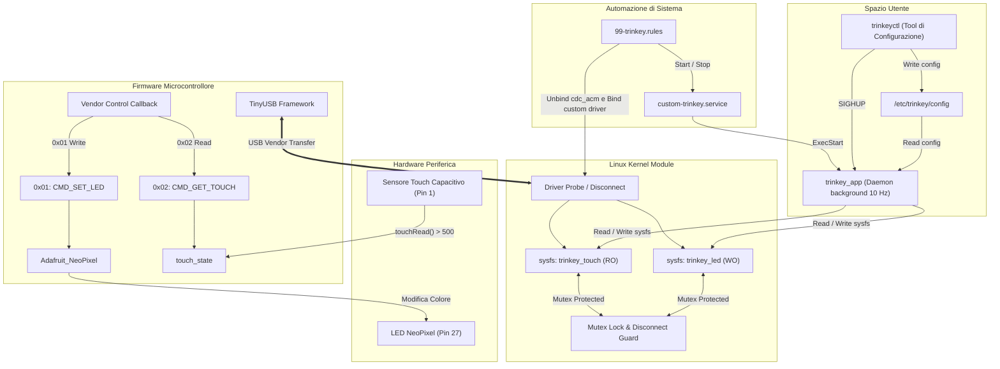

# Report Dettagliato del Progetto: NeoTrinkey Custom Driver

Questo documento fornisce un'analisi tecnica approfondita del progetto **NeoTrinkey Custom Driver**, sviluppato per l'insegnamento di *Sistemi Operativi Avanzati*. Il progetto implementa una pila software completa (*full-stack embedded & system programming*) per la gestione del dispositivo USB **Adafruit NeoKey Trinkey** (Vendor ID `0x239a`, Product ID `0x80ff`).

---

## 1. Architettura Generale del Sistema

Il progetto sostituisce il driver di classe generico USB Serial (`cdc_acm`) fornito da Linux con una soluzione personalizzata a bassissimo livello, estendendosi dal microcontrollore fino allo spazio utente.

---

## 2. Analisi Dettagliata dei Componenti e dei File

### 2.1 Firmware Microcontrollore

#### [firmware.cpp](file:///c:/Users/passo/OneDrive/Desktop/UNI/NeoTrinkey_custom_driver-main/firmware.cpp)
* **Linguaggio / Framework**: C++ con Arduino Core e **Adafruit TinyUSB**.
* **Funzione principale**:
  * Inizializza il LED NeoPixel (Pin 27) e la lettura capacitiva (Pin 1).
  * Gestisce le chiamate **USB Vendor Request** tramite la callback `tud_vendor_control_xfer_cb`:
    * `0x01` (`CMD_SET_LED`): Riceve 3 byte (RGB) dall'host USB ed aggiorna istantaneamente il colore del pixel.
    * `0x02` (`CMD_GET_TOUCH`): Restituisce all'host 1 byte contenente lo stato del sensore capacitivo (valore `1` se `touchRead(PIN_TOUCH) > 500`, altrimenti `0`).

---

### 2.2 Driver del Kernel Linux

#### [NeoTrinkey_custom_driver.c](file:///c:/Users/passo/OneDrive/Desktop/UNI/NeoTrinkey_custom_driver-main/NeoTrinkey_custom_driver.c)
* **Linguaggio**: C (Linux Kernel Module).
* **Funzione principale**:
  * Registra un driver USB per il dispositivo `Vendor 0x239a` / `Product 0x80ff`.
  * **Interfaccia sysfs**:
    * `trinkey_touch` (`RO`): Esegue `usb_control_msg_recv` con `CMD_GET_TOUCH` (0x02) per leggere lo stato del touch.
    * `trinkey_led` (`WO`): Riceve una stringa `"R G B"`, valida che i valori rientrino nel range `0..255`, ed esegue `usb_control_msg_send` con `CMD_SET_LED` (0x01).
  * **Concorrenza e Protezione**:
    * Utilizza un `struct mutex lock` per serializzare gli accessi concorrenti via `sysfs`.
    * Imposta il flag `disconnected = true` nella callback `trinkey_disconnect` prima di liberare la memoria per prevenire race condition e vulnerabilità di tipo **Use-After-Free** se un file sysfs viene letto/scritto durante l'estrazione fisica del dispositivo.
    * Utilizza la macro moderna `sysfs_emit` anziché `sprintf`.

#### [Makefile](file:///c:/Users/passo/OneDrive/Desktop/UNI/NeoTrinkey_custom_driver-main/Makefile)
* Configurato per compilare il modulo del kernel `NeoTrinkey_custom_driver.o` riutilizzando il build system del kernel installato (`/lib/modules/$(uname -r)/build`).

---

### 2.3 Daemon e Tool Spazio Utente

#### [trinkey_app.c](file:///c:/Users/passo/OneDrive/Desktop/UNI/NeoTrinkey_custom_driver-main/trinkey_app.c)
* **Linguaggio**: C (Userspace Daemon).
* **Funzione principale**:
  * **Scoperta dinamica**: Scansiona la directory `/sys/bus/usb/devices/` cercando la periferica con `idVendor == 239a` e `idProduct == 80ff`, individuando automaticamente i nodi `trinkey_led` e `trinkey_touch`.
  * **Gestione segnali**:
    * `SIGINT`: Chiusura pulita (spegnimento LED e rimozione PID file).
    * `SIGHUP`: Imposta il flag `reload_config` per ricaricare `/etc/trinkey/config` al volo senza riavviare il processo.
  * **Loop a 10 Hz**:
    * Se il sensore touch è premuto (`get_touch() == 1`), forza il colore al colore di tocco (`color_touch`).
    * Altrimenti esegue la modalità idle richiesta:
      * `MODE_STATIC`: Mantiene costante il colore `color_idle`.
      * `MODE_BLINK`: Lampeggio a 0.5 Hz (attivo per 5 tick, spento per 5 tick).
      * `MODE_BREATH`: Transizione fluida basata sulla funzione sinusoidale ($sin(\theta)$) calcolata su un ciclo di 3 secondi (30 tick).

#### [trinkeyctl.c](file:///c:/Users/passo/OneDrive/Desktop/UNI/NeoTrinkey_custom_driver-main/trinkeyctl.c)
* **Linguaggio**: C (CLI Utility).
* **Funzione principale**:
  * Interfaccia a riga di comando con parsing degli argomenti via `getopt`:
    * `-m <mode>`: Imposta la modalità (`static`, `blink`, `breath`).
    * `-i "R G B"`: Imposta il colore di idle (es. `"255 0 0"`).
    * `-t "R G B"`: Imposta il colore di tocco (es. `"0 255 0"`).
  * Valida attentamente l'input dell'utente.
  * Preserva le impostazioni non modificate leggendo il file esistente `/etc/trinkey/config`.
  * Scrive il nuovo file di configurazione ed invia un segnale `SIGHUP` al daemon leggendo il PID da `/run/trinkey/trinkey.pid`.

---

### 2.4 Automazione e Gestione di Sistema

#### [99-trinkey.rules](file:///c:/Users/passo/OneDrive/Desktop/UNI/NeoTrinkey_custom_driver-main/99-trinkey.rules)
* **Regola udev per Linux**:
  * Ignora il dispositivo per ModemManager (`ID_MM_DEVICE_IGNORE="1"`).
  * Esegue l'unbind dell'interfaccia USB dal driver standard `cdc_acm`.
  * Esegue il bind dell'interfaccia al driver personalizzato `adafruit_trinkey_custom`.
  * All'evento `add` (collegamento USB), avvia in background `custom-trinkey.service` tramite `systemd-run`.
  * All'evento `remove` (scollegamento USB), arresta immediatamente il servizio.

#### [custom-trinkey.service](file:///c:/Users/passo/OneDrive/Desktop/UNI/NeoTrinkey_custom_driver-main/custom-trinkey.service)
* **Unità systemd**:
  * Esegue il binario `/usr/local/bin/trinkey_app`.
  * Riavvia automaticamente il daemon in caso di crash (`Restart=on-failure`, `RestartSec=2`).
  * Gestisce la creazione della directory temporanea di runtime `/run/trinkey` con permessi `0755`.

#### [README.md](file:///c:/Users/passo/OneDrive/Desktop/UNI/NeoTrinkey_custom_driver-main/README.md)
* Documenta le istruzioni di installazione, il posizionamento dei binari in `/usr/local/bin/`, la creazione del gruppo utenti `trinkey` e la configurazione dei permessi (incluso il bit SUID `chmod 4755` per `trinkeyctl` se necessario).

---

## 3. Matrice dei File e Compiti

| Nome File | Ambito | Tecnologia | Descrizione Sintetica |
| :--- | :--- | :--- | :--- |
| [firmware.cpp](file:///c:/Users/passo/OneDrive/Desktop/UNI/NeoTrinkey_custom_driver-main/firmware.cpp) | Firmware | C++ / TinyUSB | Gestisce LED NeoPixel e lettura capacitiva rispondendo a USB Vendor Requests |
| [NeoTrinkey_custom_driver.c](file:///c:/Users/passo/OneDrive/Desktop/UNI/NeoTrinkey_custom_driver-main/NeoTrinkey_custom_driver.c) | Kernel | C (Linux LKM) | Modulo Kernel USB; espone `trinkey_touch` e `trinkey_led` in `sysfs` con mutex lock |
| [Makefile](file:///c:/Users/passo/OneDrive/Desktop/UNI/NeoTrinkey_custom_driver-main/Makefile) | Build | Make / Kbuild | Compila il driver di kernel per l'architettura host |
| [trinkey_app.c](file:///c:/Users/passo/OneDrive/Desktop/UNI/NeoTrinkey_custom_driver-main/trinkey_app.c) | Userspace | C | Daemon a 10 Hz per gestione effetti visivi e reazione al touch con ricarica al volo via `SIGHUP` |
| [trinkeyctl.c](file:///c:/Users/passo/OneDrive/Desktop/UNI/NeoTrinkey_custom_driver-main/trinkeyctl.c) | Userspace | C | CLI per aggiornare la configurazione in `/etc/trinkey/config` e notificare il daemon |
| [99-trinkey.rules](file:///c:/Users/passo/OneDrive/Desktop/UNI/NeoTrinkey_custom_driver-main/99-trinkey.rules) | System OS | udev | Unbind dal driver seriale generico, bind al driver custom, auto-start/stop del servizio systemd |
| [custom-trinkey.service](file:///c:/Users/passo/OneDrive/Desktop/UNI/NeoTrinkey_custom_driver-main/custom-trinkey.service) | System OS | systemd | Gestione ciclo di vita del servizio daemon |
| [README.md](file:///c:/Users/passo/OneDrive/Desktop/UNI/NeoTrinkey_custom_driver-main/README.md) | Docs | Markdown | Guida alla configurazione, permessi e deploy di sistema |

---

## 4. Valutazione Tecnica e Punti di Forza

1. **Separazione delle Responsabilità**: Ogni strato software si occupa esattamente del proprio livello d'astrazione senza sovrapposizioni.
2. **Robustezza nel Kernel**:
   - Pulito l'uso delle API moderne del kernel Linux (`sysfs_emit`, `usb_control_msg_recv`, `usb_control_msg_send`).
   - Sincronizzazione thread-safe per sysfs tramite `mutex`.
   - Controllo esplicito del range di valori RGB (`0..255`).
3. **Reattività e Usabilità**:
   - L'integrazione udev/systemd consente un'esperienza *plug-and-play* reale: basta inserire la chiave USB per far partire il sistema.
   - Il meccansimo `SIGHUP` permette modifiche istantanee dell'animazione senza interrompere l'esecuzione del daemon.

---

## 5. Ripristino del Firmware Originale e Bootloader Recovery

Di fabbrica Adafruit spedisce la NeoKey Trinkey non con un firmware C++ compilato, bensì con **CircuitPython** ed uno script demo in Python. È sempre possibile ripristinare il comportamento originale senza rischiare di danneggiare il dispositivo.

### Procedura di Ripristino (UF2 Flash)

1. **Attivazione Bootloader**: Collegare la chiave USB al computer ed eseguire un **doppio clic rapido sul pulsante di Reset**. Il microcontrollore entrerà in modalità UF2 Bootloader esponendo un disco USB denominato `TRINKEYBOOT`.
2. **Flash di CircuitPython**: Scaricare l'immagine `.uf2` aggiornata da [circuitpython.org/downloads](https://circuitpython.org/downloads) cercando *Adafruit NeoKey Trinkey*. Copiare il file `.uf2` dentro la chiavetta `TRINKEYBOOT`. La scheda si riavvierà mostrando la nuova unità `CIRCUITPY`.
3. **Demo di Fabbrica**: Copiare lo script demo originale da Adafruit nel file `code.py` all'interno del disco `CIRCUITPY`.

### Risorse e Repository Ufficiali Adafruit

* **Guida Ufficiale Adafruit**: [Learn Adafruit - NeoKey Trinkey](https://learn.adafruit.com/adafruit-neokey-trinkey)
* **Libreria CircuitPython NeoKey**: [github.com/adafruit/Adafruit_CircuitPython_NeoKey](https://github.com/adafruit/Adafruit_CircuitPython_NeoKey)
* **Design Hardware e PCB**: [github.com/adafruit/Adafruit-NeoKey-Trinkey-PCB](https://github.com/adafruit/Adafruit-NeoKey-Trinkey-PCB)
* **Bootloader UF2 (SAMD21)**: [github.com/adafruit/uf2-samdx1](https://github.com/adafruit/uf2-samdx1)

---

## 6. Possibili Sviluppi Futuri

* **Uso di Interrupt / URB Async**: Attualmente il driver legge il touch tramite una richiesta di controllo sincrona avviata dallo spazio utente (`polling`). Si potrebbe implementare un'infrastruttura basata su USB Interrupt URB nel kernel con notifiche `poll`/`epoll` verso lo spazio utente per azzerare l'uso di CPU in assenza di eventi.
* **Supporto Multicolore / Animazioni Avanzate**: Espansione del firmware per supportare pattern dinamici gestiti direttamente dal microcontrollore riducendo il traffico sul bus USB.
