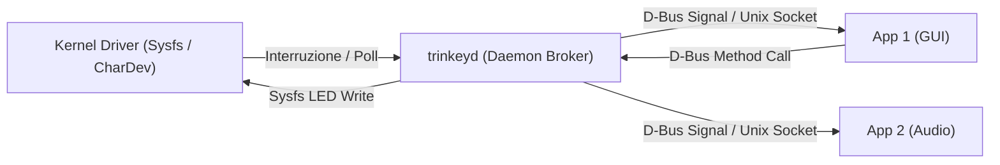

# Report Tecnico: Architettura Publisher-Subscriber tra Driver Kernel e User-Space App (NeoTrinkey)

**Autore**: Antigravity AI  
**Data**: 24 Luglio 2026  
**Ambito**: Progetto NeoTrinkey Custom Driver (Sistemi Operativi Avanzati)  
**Obiettivo**: Progettazione e analisi di un sistema Publisher-Subscriber per la gestione asincrona degli eventi touch e l'attivazione dei LED RGB sul dispositivo Adafruit NeoKey Trinkey.

---

## 1. Introduzione e Motivazione

L'architettura attuale del progetto si basa su un modello **Sysfs Polling** in cui l'applicazione user-space (`trinkey_app`) interroga periodicamente (a 10 Hz via `usleep(100000)`) il file sysfs `/sys/bus/usb/devices/.../trinkey_touch`.

### Limiti del Modello Attuale:
1. **Spreco di Risorse (CPU & USB Overhead)**: Il driver effettua una transazione USB di tipo Control Transfer (`CMD_GET_TOUCH`) ad ogni tick di clock (ogni 100 ms), anche se il pulsante touch non cambia stato per ore.
2. **Latenza di Risposta**: Un evento touch avvenuto all'inizio dell'intervallo di sleep viene rilevato solo al tick successivo (fino a 100 ms di latenza).
3. **Single-Subscriber / Mancanza di Scalabilità**: Sysfs è progettato per interrogazioni puntuali da parte di un singolo processo. Non permette a **più applicazioni indipendenti** (es. un daemon di sistema, una GUI utente, un servizio di notifica) di registrarsi simultaneamente per ricevere notifiche asincrone in tempo reale.
4. **Assenza di Disaccoppiamento tra Eventi e Azioni**: L'app si occupa sia di fare polling che di calcolare gli stati del LED e scriverli al driver.

### Soluzione Proposta: Pattern Publisher-Subscriber (Pub/Sub)
Sostituire o affiancare il meccanismo sysfs con un'architettura **Publisher-Subscriber**, dove:
* **Publisher (Kernel Driver / Hardware Driver)**: Rileva i cambiamenti di stato del touch ed emette un evento asincrono verso un canale o bus.
* **Subscribers (User-Space Apps)**: N applicazioni si iscrivono al canale degli eventi touch e reagiscono in tempo reale (es. una cambia il colore del LED, un'altra invia una notifica audio o desktop).
* **Command Channel (LED Controller)**: Un canale inverso per la pubblicazione di comandi di aggiornamento colore LED.

---

## 2. Architettura Generale del Sistema Pub/Sub

```mermaid
flowchart TD
    subgraph HW ["Hardware NeoTrinkey"]
        TOUCH_SENS["Touch Capacitivo (Pin 1)"]
        LED_HW["LED NeoPixel (Pin 27)"]
    end

    subgraph Firmware ["Firmware Microcontrollore"]
        USB_INT["USB Interrupt IN Endpoint / Vendor Control"]
    end

    subgraph Kernel ["Linux Kernel Space (Publisher & Device Driver)"]
        USB_CORE["USB Driver Core / URB Handler"]
        TOUCH_MONITOR["Touch Monitor (Interrupt URB / Timer)"]
        PUB_ENGINE["Kernel Pub/Sub Engine"]
        NETLINK_PUB["Netlink Multicast / CharDev Ring Buffers"]
    end

    subgraph IPC ["Canale di Comunicazione Kernel-Userspace"]
        NL_SOCK["Netlink Multicast Group / /dev/trinkey_event"]
        DBUS_BUS["D-Bus System Bus (Opzionale Broker Daemon)"]
    end

    subgraph Userspace ["Spazio Utente (Subscribers & Controllers)"]
        SUB_APP1["App 1: Controller LED (Gestore Pattern/Effetti)"]
        SUB_APP2["App 2: Desktop Notification Daemon"]
        SUB_APP3["App 3: Logger / Analytics Service"]
        CLI_TOOL["trinkeyctl (Publisher di Comandi LED)"]
    end

    TOUCH_SENS -->|"Stato Touch"| USB_INT
    USB_INT <==>"USB Transfers"| USB_CORE
    USB_CORE --> TOUCH_MONITOR
    TOUCH_MONITOR -->|"Event: TOUCH_PRESSED / RELEASED"| PUB_ENGINE
    PUB_ENGINE --> NL_SOCK
    
    NL_SOCK -->|"Broadcast Events"| SUB_APP1
    NL_SOCK -->|"Broadcast Events"| SUB_APP2
    NL_SOCK -->|"Broadcast Events"| SUB_APP3
    
    SUB_APP1 -->|"Command: SET_LED (RGB)"| NETLINK_PUB --> USB_CORE --> LED_HW
```

---

## 3. Analisi Tecnica delle Soluzioni Implementative

Si analizzano **4 approcci architetturali principali** per la realizzazione del sistema Pub/Sub nel kernel Linux e nello spazio utente.

---

### Soluzione A: Kernel Netlink Sockets con Multicast Groups (Raccomandata Native Kernel)

Netlink è il protocollo socket nativo di Linux per la comunicazione bidirezionale ed eventi asincroni tra kernel e spazio utente (usato da `udev`, `nl80211`, `iproute2`).

#### Architettura e Funzionamento:
1. **Multicast Group nel Kernel**: Il driver registra una famiglia Generic Netlink (o usa `NETLINK_USERSOCK`) definendo un gruppo Multicast (es. `TRINKEY_MC_TOUCH_EVENTS`).
2. **Pubblicazione Eventi (Publisher)**: Quando il driver rileva una variazione di stato (Touch DOWN / Touch UP), invia uno sk_buff Netlink in multicast usando `genlmsg_multicast()` o `nlmsg_multicast()`.
3. **Iscrizione Client (Subscribers)**: Più applicazioni in spazio utente aprono un socket `socket(AF_NETLINK, SOCK_RAW, NETLINK_GENERIC)`, si iscrivono al gruppo Multicast ed attendono eventi in modo non bloccante con `epoll()` o `select()`.
4. **Comandi LED (Unicast Command Channel)**: I client (o il controller principale) inviano messaggi Netlink Unicast al driver contenenti i payload RGB (`CMD_SET_LED`).

#### Vantaggi:
* **True Multicast**: Il kernel duplica efficientemente il messaggio per tutti i socket registrati al gruppo.
* **Standard Linux**: Perfetta integrazione con l'event-driven programming di Linux (`epoll`, `libev`, `libuv`).
* **Supporto Bidirezionale**: Stessa infrastruttura sia per notifiche eventi (Touch -> Userspace) che per comandi (Userspace -> LED -> Kernel).

#### Svantaggi:
* Richiede la struttura Generic Netlink (`net/genetlink.h`) che aggiunge una lieve complessità nel codice del driver.

---

### Soluzione B: Character Device (`/dev/trinkey_event`) con Event Ring Buffers ed `epoll`

Questa soluzione estende il classico driver a caratteri per supportare connessioni multi-client ed I/O asincrono.

#### Architettura e Funzionamento:
1. Il driver registra un dispositivo `/dev/trinkey_event`.
2. Nella syscall `open()`, il driver alloca una struttura dati per ogni client connesso:
   ```c
   struct trinkey_subscriber {
       struct list_head node;
       wait_queue_head_t wq;
       struct kfifo event_fifo; // Buffer circolare eventi privato
       struct fasync_struct *fasync;
   };
   ```
3. **Pubblicazione Evento**: All'evento touch, il driver itera sulla lista dei subscriber registrati (`list_for_each`), inserisce l'evento (`struct trinkey_event { u8 state; u64 timestamp_ns; }`) in ogni `kfifo` e sveglia i client con `wake_up_interruptible(&sub->wq)` e `kill_fasync(&sub->fasync, SIGIO, POLL_IN)`.
4. **Iscrizione e Lettura**: L'app chiama `open("/dev/trinkey_event")` ed attende dati con `read()` o `epoll_wait()`.
5. **Controllo LED**: La scrittura (`write()`) sul char device da parte di un processo autorizzato inoltra il comando RGB al firmware.

#### Vantaggi:
* Basato sulle tradizionali file operations Linux (`open`, `read`, `write`, `poll`, `fasync`).
* Molto facile da testare da riga di comando (`cat /dev/trinkey_event`).

#### Svantaggi:
* Gestione manuale della memoria per ogni subscriber (allocazione/liberazione kfifo ed eventuale perdita di eventi se un buffer client si riempie).

---

### Soluzione C: Linux Input Subsystem (`evdev` / `/dev/input/eventX`)

Sfrutta il sottosistema Input nativo del kernel Linux per trasformare il touch in un vero tasto/interruttore di sistema.

#### Architettura e Funzionamento:
1. Il driver alloca e registra una struttura `struct input_dev` (`input_allocate_device()`, `input_register_device()`).
2. Configura il tipo di evento supportato: `EV_KEY` (es. `BTN_0` o `KEY_OPTION`) oppure `EV_SW` (switch touch).
3. **Pubblicazione Eventi**: Alla pressione/rilascio, il driver chiama:
   ```c
   input_report_key(input_dev, BTN_0, touch_state);
   input_sync(input_dev);
   ```
4. **Subscribers**: Il kernel inoltra automaticamente l'evento a tutti i client aperti su `/dev/input/eventX` (gestito nativamente in Pub/Sub dal sottosistema `evdev`).
5. **Controllo LED**: Si gestisce via `EV_LED` o mantenendo l'attributo `sysfs_led`.

#### Vantaggi:
* **Integrazione di Sistema Immediata**: Il touch può simulare un tasto della tastiera ed attivare shortcut a livello di sistema operativo senza software aggiuntivo.
* **Pub/Sub nativo e collaudato**: Sottosistema kernel maturo e privo di bug.

#### Svantaggi:
* Meno flessibile per eventi proprietari personalizzati o dati ausiliari (es. valori grezzi capacitivi).

---

### Soluzione D: Architettura Daemon-Broker in Userspace (D-Bus / Unix Domain Sockets)

Invece di spostare tutta la logica Pub/Sub nel kernel, si implementa un **Broker Daemon** in spazio utente (`trinkeyd`).



#### Architettura e Funzionamento:
1. Il driver kernel espone un'interfaccia semplice (es. `sysfs_notify` o char dev).
2. Un daemon leggero di sistema (`trinkeyd`) si connette al driver ed agisce da **Pub/Sub Broker**:
   * Espone un bus **D-Bus** (es. servizio `org.freedesktop.NeoTrinkey`, segnale `TouchStateChanged(bool pressed)`).
   * Oppure espone una socket **Unix Domain Socket** con protocollo Pub/Sub (o broker ZeroMQ/MQTT integrato).
3. Qualsiasi applicazione (Python, C, Rust, Node.js) si iscrive al segnale D-Bus o alla socket per ricevere le notifiche touch e inviare i comandi LED.

#### Vantaggi:
* **Massimo Disaccoppiamento**: Il codice kernel rimane minimale e stabile.
* **Sicurezza & Permessi**: Integrazione diretta con Polkit e permessi D-Bus per controllare quali utenti/app possono regolare i LED.
* **Facilità di Sviluppo**: Creare subscriber in qualsiasi linguaggio di programmazione diventa banalissimo.

---

## 4. Matrice Comparativa dei Modelli Architetturali

| Criterio | Soluzione A: Netlink Multicast | Soluzione B: CharDev Multi-Subscriber | Soluzione C: Input Subsystem (`evdev`) | Soluzione D: Daemon Broker (D-Bus/IPC) |
| :--- | :--- | :--- | :--- | :--- |
| **Latenza Notifica** | Basse (< 1 ms) | Basse (< 1 ms) | Basse (< 1 ms) | Molto Bassa (~1-2 ms) |
| **Overhead CPU / USB** | Minimale (Event-driven) | Minimale (Event-driven) | Minimale (Event-driven) | Minimale |
| **Complessità Codice Kernel** | Media | Alta (gestione list & kfifo) | Bassa | Minima (Kernel semplice) |
| **Multi-Subscriber Support** | Nativo (Multicast) | Gestito nel Driver | Nativo (evdev core) | Nativo (D-Bus / Broker) |
| **Controllo Permessi / Security** | Netlink CAP_NET_ADMIN | File permissions su `/dev` | Group `input` permissions | Polkit / D-Bus ACL |
| **Integrazione con il Desktop** | Media | Bassa | Eccellente (Input nativo) | Eccellente (Systemd/D-Bus) |

---

## 5. Progettazione di Dettaglio: Soluzione Raccomandata (Netlink Generic Multicast)

Per un progetto di **Sistemi Operativi Avanzati**, la soluzione **Netlink Multicast** rappresenta il compromesso ideale per dimostrare competenze avanzate di kernel programming e IPC event-driven.

### 5.1 Definizione della Struttura Dati dell'Evento
```c
/* Header comune evento / comando */
enum trinkey_nl_commands {
    TRINKEY_CMD_UNSPEC,
    TRINKEY_CMD_TOUCH_EVENT,  /* Kernel -> Userspace (Multicast) */
    TRINKEY_CMD_SET_LED,      /* Userspace -> Kernel (Unicast) */
    __TRINKEY_CMD_MAX,
};

enum trinkey_nl_attrs {
    TRINKEY_ATTR_UNSPEC,
    TRINKEY_ATTR_TOUCH_STATE, /* u8: 0 = Rilasciato, 1 = Premuto */
    TRINKEY_ATTR_TIMESTAMP,   /* u64: Nanosecondi (ktime_get_real_ns) */
    TRINKEY_ATTR_LED_RGB,     /* u32 / 3x u8: Valori R, G, B */
    __TRINKEY_ATTR_MAX,
};
```

### 5.2 Implementazione Lato Kernel (Publisher)

```c
/* Esempio concettuale di pubblicazione evento touch via Netlink */
static void trinkey_publish_touch_event(struct trinkey_dev *tdev, u8 touch_state)
{
    struct sk_buff *skb;
    void *msg_head;
    int ret;

    /* Allocazione buffer Netlink sk_buff */
    skb = genlmsg_new(NLMSG_GOODSIZE, GFP_ATOMIC);
    if (!skb)
        return;

    /* Costruzione Header Generic Netlink */
    msg_head = genlmsg_put(skb, 0, 0, &trinkey_gnl_family, 0, TRINKEY_CMD_TOUCH_EVENT);
    if (!msg_head) {
        nlmsg_free(skb);
        return;
    }

    /* Inserimento Attributi (Stato Touch e Timestamp) */
    nla_put_u8(skb, TRINKEY_ATTR_TOUCH_STATE, touch_state);
    nla_put_u64_64bit(skb, TRINKEY_ATTR_TIMESTAMP, ktime_get_real_ns(), TRINKEY_ATTR_PAD);

    genlmsg_end(skb, msg_head);

    /* Invio Multicast a tutti i subscriber registrati nel gruppo 1 */
    genlmsg_multicast(&trinkey_gnl_family, skb, 0, TRINKEY_MC_GROUP_TOUCH, GFP_ATOMIC);
}
```

### 5.3 Implementazione Lato User-Space (Subscriber Event-Loop)

```c
/* Subscriber C in spazio utente con epoll */
int main(void)
{
    int nl_fd = setup_netlink_subscriber_socket();
    int epoll_fd = epoll_create1(0);

    struct epoll_event ev, events[5];
    ev.events = EPOLLIN;
    ev.data.fd = nl_fd;
    epoll_ctl(epoll_fd, EPOLL_CTL_ADD, nl_fd, &ev);

    printf("Subscriber avviato. In attesa di eventi touch da NeoTrinkey...\n");

    while (running) {
        int nfds = epoll_wait(epoll_fd, events, 5, -1);
        for (int n = 0; n < nfds; ++n) {
            if (events[n].data.fd == nl_fd) {
                struct trinkey_event evt = read_netlink_event(nl_fd);
                printf("[EVENTO RECEVUTO] Touch State: %s | Timestamp: %llu ns\n",
                       evt.state ? "PRESSED" : "RELEASED", evt.timestamp);
                
                /* Reazione dello subscriber: ad esempio richiesta cambio LED */
                if (evt.state) {
                    send_led_command_unicast(nl_fd, 0, 255, 0); // Verde al touch
                } else {
                    send_led_command_unicast(nl_fd, 255, 0, 0); // Rosso idle
                }
            }
        }
    }
    close(nl_fd);
    return 0;
}
```

---

## 6. Piano di Migrazione ed Integrazione

Per evolvere il sistema attuale verso l'architettura Pub/Sub in modo graduale, si consiglia la seguente tabella di marcia:

1. **Fase 1: Asincronia Hardware (USB Interrupt Endpoint)**
   * Modificare la gestione USB nel driver da Control Transfers sincroni (`CMD_GET_TOUCH`) ad un **Interrupt IN URB** continuo che notifica il kernel solo all'effettiva variazione capacitiva.
2. **Fase 2: Integrazione Netlink / CharDev Publisher**
   * Aggiungere l'infrastruttura Netlink Multicast al modulo kernel `NeoTrinkey_custom_driver.c`.
3. **Fase 3: Refactoring di `trinkey_app`**
   * Sostituire il ciclo `while` con `usleep(100000)` con un event loop basato su `epoll` in ascolto sul socket Netlink.
4. **Fase 4: Estensione Multi-Subscriber**
   * Creare una seconda app o uno script di sistema (es. notifica audio o logging) che si iscrive in parallelo al gruppo Multicast senza interferire con `trinkey_app`.

---

## 7. Conclusione

La transizione ad un pattern **Publisher-Subscriber** risolve i limiti fondamentali del modello a polling sysfs. L'adozione di **Netlink Multicast** o di un **Broker Daemon D-Bus** eleva il progetto NeoTrinkey a uno standard industriale professionale:
* **Overhead USB e CPU azzerati** in assenza di interazione utente.
* **Latenza reattiva sotto il millisecondo**.
* **Scalabilità multi-client illimitata** per la gestione coordinata di eventi touch e animazioni dei LED RGB.
